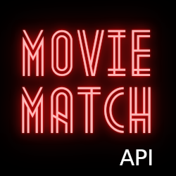

### Find a movie to watch together 📽️❤️

## 🤔 What is this?
An API to support upcoming Movie Match applications
- C# function app
- Retrieves data from the TMDB API
- Hosted in Azure, deployed with Bicep IaC
- CI/CD with GitHub actions

## 📝 Project
- [Impact Map](https://github.com/DanielRobinsonSoftware?tab=projects)
- [Kanban board](https://github.com/users/DanielRobinsonSoftware/projects/1)

## 🤷 Motivation
This is a non-profit, solo project for fun and practice.

## 👏 Attribution
- The <a href="https://josipkelava.com/metropolis-1920">Metropolis font</a> used in the logo was designed by Josip Kelava
- The movie data is sourced from  The Movie Database - this product uses the TMDB API but is not endorsed or certified by TMDB